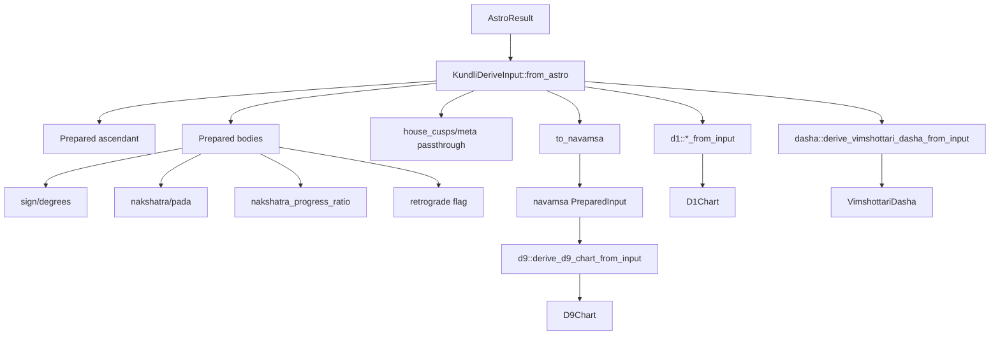
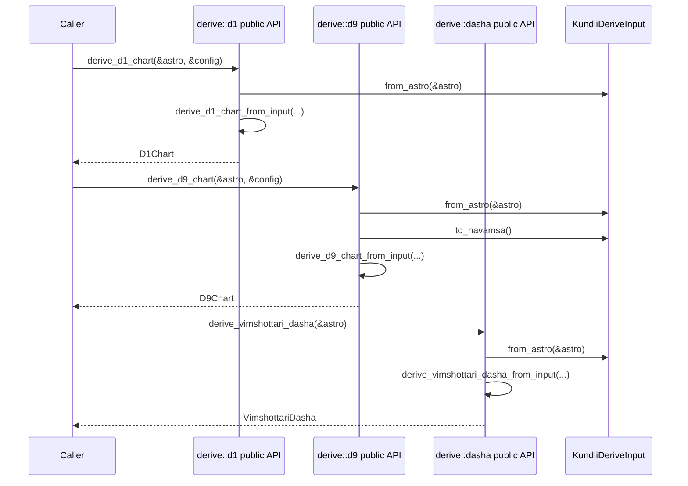

# Kundli derive 구현 개요

이 문서는 현재 `kundli-rs`의 derive 레이어가 `AstroResult`를 어떻게 Kundli 도메인 값으로 해석하는지 정리한다. 현재 구조의 핵심은 **raw astronomy 결과를 먼저 `KundliDeriveInput`으로 정규화/전처리한 뒤**, D1 / D9 / Dasha가 그 intermediate를 재사용하는 것이다.

---

## 1. 문서 범위

설명 대상 파일은 다음과 같다.

- crate root: `src/lib.rs:1`
- kundli module: `src/kundli/mod.rs:1`
- astro public API: `src/kundli/astro/mod.rs:7`
- astro result contract: `src/kundli/astro/result.rs:21`
- config: `src/kundli/config.rs:3`
- error: `src/kundli/error.rs:5`
- model: `src/kundli/model.rs:3`
- derive module: `src/kundli/derive/mod.rs:1`
- derive intermediate: `src/kundli/derive/input.rs:11`
- derive helpers:
  - `src/kundli/derive/sign.rs:18`
  - `src/kundli/derive/nakshatra.rs:24`
  - `src/kundli/derive/house.rs:23`
- D1 assembly: `src/kundli/derive/d1.rs:12`
- D9 assembly: `src/kundli/derive/d9.rs:9`
- Dasha assembly: `src/kundli/derive/dasha.rs:10`
- integration tests:
  - `tests/derive_d1.rs:1`
  - `tests/derive_d9.rs:1`
  - `tests/derive_dasha.rs:1`
- smoke test: `tests/astro_smoke.rs:148`

---

## 2. 구현 목표

derive 레이어의 역할은 Swiss Ephemeris 기반의 raw 결과인 `AstroResult`를 Kundli 의미 정보로 해석하는 것이다.

현재 제공하는 결과는 다음과 같다.

- `LagnaResult`
- `PlanetPlacement`
- `HouseResult`
- `D1Chart`
- `D9Chart`
- `VimshottariDasha`

핵심 원칙은 다음과 같다.

1. `astro` 레이어는 천문 계산만 담당한다.
2. `derive` 레이어는 해석과 조립만 담당한다.
3. 공통 longitude 해석은 `KundliDeriveInput`에서 한 번 수행한다.
4. D9와 Dasha는 현재 sidereal 입력만 지원한다.
5. D9 하우스는 현재 WholeSign만 지원한다.

---

## 3. 현재 모듈 구조

### 3.1 공개 모듈

`src/lib.rs:1`

```rust
pub mod kundli;
```

`src/kundli/mod.rs:1-5`

```rust
pub mod astro;
pub mod config;
pub mod derive;
pub mod error;
pub mod model;
```

### 3.2 astro 공개 surface

`src/kundli/astro/mod.rs:7-10`

```rust
pub use engine::{AstroEngine, SwissEphAstroEngine, SwissEphConfig};
pub use error::AstroError;
pub use request::{AstroBody, AstroRequest, Ayanamsha, HouseSystem, NodeType, ZodiacType};
pub use result::{AstroBodyPosition, AstroMeta, AstroResult};
```

### 3.3 derive 모듈 구조

`src/kundli/derive/mod.rs:1-7`

```rust
pub mod d1;
pub mod d9;
pub mod dasha;
pub(crate) mod house;
pub(crate) mod input;
pub(crate) mod nakshatra;
pub(crate) mod sign;
```

외부 호출자가 직접 쓰는 public entry point는 현재 다음 세 모듈이다.

- `kundli::derive::d1`
- `kundli::derive::d9`
- `kundli::derive::dasha`

반면 아래는 derive 내부 구현용이다.

- `input`
- `sign`
- `nakshatra`
- `house`

---

## 4. 핵심 계약

### 4.1 AstroResult

`src/kundli/astro/result.rs:21-28`

```rust
pub struct AstroResult {
    pub bodies: [AstroBodyPosition; AstroBody::ALL.len()],
    pub ascendant_longitude: f64,
    pub mc_longitude: f64,
    pub house_cusps: [f64; 12],
    pub meta: AstroMeta,
}
```

`AstroResult`는 더 이상 request-shaped partial result가 아니라 derive가 바로 소비하는 canonical full snapshot이다. `bodies`는 항상 `AstroBody::ALL` 순서를 따르고, `house_cusps`도 항상 12개를 보장한다.

derive가 실제로 사용하는 필드는 다음과 같다.

- `bodies`
- `ascendant_longitude`
- `house_cusps`
- `meta.jd_ut`
- `meta.zodiac`
- `meta.ayanamsha`, `meta.ayanamsha_value`, `meta.sidereal_time`는 현재 `KundliDeriveInput.meta`로 보존되지만, derive 계산 핵심 분기에는 직접적으로 많이 쓰이지 않는다.
- `mc_longitude`는 현재 derive 레이어에서 사용하지 않는다.

### 4.2 KundliConfig

`src/kundli/config.rs:1-101`

현재 `KundliConfig`는 여전히 duplicated astro settings를 보존하지만, 권장 조립 경로는 struct literal보다 생성 메서드다.

```rust
let request = AstroRequest::new(jd_ut, latitude, longitude)
    .with_zodiac(zodiac)
    .with_ayanamsha(ayanamsha)
    .with_house_system(house_system)
    .with_node_type(node_type);

let config = KundliConfig::from_request(&request)
    .with_charts(&[
    KnownChart::D1,
    KnownChart::D9,
    KnownChart::VimshottariDasha,
]);
```

이 패턴의 핵심 의도는 request/config에 중복된 zodiac-related 설정이 처음부터 일치하도록 만드는 것이다.

현재 derive 레이어에서 직접 의미가 있는 값은 주로 `house_system`이다.

- D1: `house_system`에 따라 WholeSign / cusp 기반 분기
- D9: `house_system == WholeSign`인지 검증

`charts` selection은 현재 derive 함수 내부에서는 소비되지 않는다. 이 값은 상위 orchestration에서 어떤 chart layer를 `KundliResult.charts` 컬렉션에 조립할지 결정할 때 의미를 가진다.

### 4.3 결과 모델

핵심 결과 타입은 `src/kundli/model.rs:85-167`에 정의되어 있다.

특히 중요한 계약은 다음과 같다.

- `PlanetPlacement`
  - body / longitude / sign / degrees_in_sign / house / nakshatra / is_retrograde
- `HouseResult`
  - house 번호는 pipeline reference 기준으로 부여된다.
  - `cusp_longitude`는 materialize된 house의 시작 longitude를 뜻한다.
  - cusp 기반 system에서는 절대 cusp를 reference-relative로 재번호화한 결과를, WholeSign에서는 reference가 속한 sign boundary 기준 house 시작점을 나타낸다.
- `VimshottariDasha`
  - `moon_nakshatra`
  - `current_mahadasha`
  - `mahadashas` 전체 시퀀스

### 4.4 에러 계약

`src/kundli/error.rs:5-129`

derive 전용 에러는 다음과 같다.

- `MissingMoon`
- `InvalidHouseCusps(usize)`
- `InvalidLongitude(f64)`
- `InvalidPada(u8)`
- `UnsupportedZodiac(ZodiacType)`
- `UnsupportedD9HouseSystem(HouseSystem)`

의미는 다음과 같다.

- `MissingMoon`: Dasha 계산에 Moon이 없을 때
- `InvalidHouseCusps`: cusp 기반 하우스 계산에 cusp 개수가 12가 아닐 때
- `InvalidLongitude`: NaN / infinity 등 비정상 longitude
- `InvalidPada`: pada 생성 불가
- `UnsupportedZodiac`: D9 / Dasha가 sidereal만 허용할 때 tropical 입력이 들어온 경우
- `UnsupportedD9HouseSystem`: D9에서 WholeSign 외 house system이 들어온 경우

추가로 high-level API는 `KundliError::InputConfigMismatch(InputConfigMismatchField)`를 통해 request/config 불일치를 typed하게 노출한다.

- `InputConfigMismatchField::Zodiac`
- `InputConfigMismatchField::Ayanamsha`
- `InputConfigMismatchField::HouseSystem`
- `InputConfigMismatchField::NodeType`

즉, 소비자는 에러 문자열 파싱 대신 enum pattern match로 어떤 public field가 어긋났는지 식별할 수 있다.

---

## 5. 중심 intermediate: KundliDeriveInput

현재 구조에서 가장 중요한 변화는 `src/kundli/derive/input.rs`에 intermediate가 생긴 점이다.

### 5.1 구조

`src/kundli/derive/input.rs:11-37`

- `PreparedAngle`
  - `longitude`
  - `sign`
  - `degrees_in_sign`
- `PreparedBody`
  - `body`
  - `longitude`
  - `sign`
  - `degrees_in_sign`
  - `nakshatra`
  - `nakshatra_progress_ratio`
  - `is_retrograde`
- `KundliDeriveInput`
  - `meta`
  - `ascendant`
  - `bodies`
  - `house_cusps`

즉, derive 레이어는 더 이상 매 chart 함수에서 raw longitude를 처음부터 반복 해석하지 않고, 먼저 **준비된 ascendant/body snapshot**을 만든다.

### 5.2 from_astro

`src/kundli/derive/input.rs:39-51`

`KundliDeriveInput::from_astro(&AstroResult)`는 다음을 한 번에 수행한다.

- ascendant longitude normalize
- ascendant sign / degrees_in_sign 계산
- 각 body longitude normalize
- 각 body sign / degrees_in_sign 계산
- 각 body nakshatra / pada 계산
- 각 body `nakshatra_progress_ratio` 계산
- 각 body retrograde 여부 계산 (`speed_longitude < 0.0`)
- `house_cusps`와 `meta` 보존

### 5.3 body lookup

`src/kundli/derive/input.rs:53-55`

```rust
pub(crate) fn body(&self, body: AstroBody) -> Option<&PreparedBody>
```

Dasha가 Moon을 찾을 때 이 lookup을 사용한다.

### 5.4 to_navamsa

`src/kundli/derive/input.rs:57-68`

D9 전용 변환은 `d9.rs`가 아니라 `input.rs`에 있다. `to_navamsa()`는 base input에서 navamsa 변환본을 만든다.

핵심 규칙:

```rust
normalize_longitude(longitude * 9.0)
```

이 변환은 ascendant와 모든 body에 적용된다. 변환 후에는 다시 아래 값들을 재계산한다.

- longitude
- sign
- degrees_in_sign
- nakshatra
- nakshatra_progress_ratio

`is_retrograde`는 그대로 보존한다.

`house_cusps`는 현재 그대로 복사되지만, D9는 WholeSign만 허용하므로 실제 하우스 계산에는 사용되지 않는다.

### 5.5 intermediate 도입의 의미

이 intermediate 덕분에 다음이 가능해졌다.

- D1이 sign / nakshatra 재해석 없이 조립에 집중
- Dasha가 Moon의 nakshatra/progress를 바로 재사용
- D9가 base input과 navamsa input을 명확히 분리
- 내부적으로 `*_from_input` 함수를 만들어 공통 해석과 chart 조립을 분리

---

## 6. helper 레이어

### 6.1 sign helper

파일: `src/kundli/derive/sign.rs:18`

제공 함수:

- `normalize_longitude(longitude)`
- `sign_from_longitude(longitude)`
- `degrees_in_sign(longitude)`

역할:

- 모든 longitude를 `[0, 360)`으로 정규화
- longitude → sign 변환
- sign 내부 degree 계산

규칙:

- finite 값이 아니면 `InvalidLongitude`
- 음수 longitude 허용 후 normalize
- `360`, `720` 등은 `0`으로 normalize

### 6.2 nakshatra helper

파일: `src/kundli/derive/nakshatra.rs:24`

제공 함수:

- `nakshatra_from_longitude`
- `pada_from_longitude`
- `degrees_in_nakshatra`
- `nakshatra_placement_from_longitude`
- `nakshatra_progress_ratio`
- `dasha_lord_for_nakshatra`

역할:

- longitude → nakshatra / pada 해석
- nakshatra 내부 progress 계산
- nakshatra → dasha lord 매핑

규칙:

- 먼저 `normalize_longitude` 재사용
- nakshatra span = `360 / 27`
- pada span = `nakshatra / 4`
- progress ratio는 `[0.0, 1.0)`

이름이 예전의 Moon 전용 helper가 아니라 **generic `nakshatra_progress_ratio`**인 점이 현재 구조를 잘 보여준다. Dasha는 Moon에 적용하고, D9는 navamsa 변환 후 다시 계산한다.

### 6.3 house helper

파일: `src/kundli/derive/house.rs:23`

제공 함수:

- `derive_house(planet_longitude, ascendant_longitude, house_cusps, house_system)`

역할:

- D1 planet placement house 계산
- D9 planet placement house 계산

분기:

- `WholeSign`
  - ascendant sign anchoring
- 그 외 house system
  - `house_cusps` 기반 판정

추가 규칙:

- cusp 기반 계산은 wrap-around 처리
- non-WholeSign이어도 ascendant longitude를 먼저 normalize/validate
- cusp 개수가 12가 아니면 `InvalidHouseCusps`

---

## 7. D1 구현

파일: `src/kundli/derive/d1.rs`

### 7.1 entry points

- internal `derive_lagna_from_input`: `src/kundli/derive/d1.rs:12`
- public `derive_lagna`: `src/kundli/derive/d1.rs:22`
- internal `derive_planet_placements_from_input`: `src/kundli/derive/d1.rs:27`
- public `derive_planet_placements`: `src/kundli/derive/d1.rs:53`
- internal `derive_houses_from_input`: `src/kundli/derive/d1.rs:61`
- public `derive_houses`: `src/kundli/derive/d1.rs:107`
- internal `derive_d1_chart_from_input`: `src/kundli/derive/d1.rs:115`
- public `derive_d1_chart`: `src/kundli/derive/d1.rs:126`

현재 D1의 public 함수들은 모두 다음 패턴을 따른다.

1. `KundliDeriveInput::from_astro(astro)` 생성
2. `*_from_input(...)` 호출

### 7.2 lagna

`derive_lagna_from_input`은 이미 준비된 `input.ascendant`를 그대로 `LagnaResult`로 옮긴다.

즉, D1 lagna 단계에서는 별도의 longitude 재해석이 없다.

### 7.3 planet placements

`derive_planet_placements_from_input`은 각 `PreparedBody`를 순회하며 `PlanetPlacement`를 만든다.

사용 값:

- `body.body`
- `body.longitude`
- `body.sign`
- `body.degrees_in_sign`
- `body.nakshatra`
- `body.is_retrograde`

추가로 house만 `derive_house(...)`로 계산한다.

즉, D1의 planet placement는 **snapshot 재사용 + house 조립** 구조다.

### 7.4 houses

`derive_houses_from_input`은 `config.house_system`에 따라 분기한다.

- WholeSign
  - ascendant가 속한 sign boundary를 1st house 시작점으로 사용
- cusp 기반
  - `input.house_cusps`를 normalize해서 `HouseResult` 생성

`HouseResult.cusp_longitude` 의미는 model의 주석 계약과 일치한다.

### 7.5 D1 chart 조립

`derive_d1_chart_from_input`은 다음 세 결과를 합친다.

- lagna
- planets
- houses

---

## 8. D9 구현

파일: `src/kundli/derive/d9.rs`

### 8.1 entry points

- internal `derive_d9_chart_from_input`: `src/kundli/derive/d9.rs:9`
- public `derive_d9_chart`: `src/kundli/derive/d9.rs:29`
- internal `derive_d9_planet_placements_from_input`: `src/kundli/derive/d9.rs:34`

### 8.2 처리 순서

`derive_d9_chart_from_input`의 실제 순서는 다음과 같다.

1. sidereal guard 검사
2. `config.house_system == WholeSign` 검사
3. `input.to_navamsa()` 호출
4. navamsa input으로 lagna 계산
5. navamsa input으로 planet placements 계산

### 8.3 핵심 특징

#### 8.3.1 navamsa 변환 위치

D9의 navamsa 변환 로직은 `d9.rs`가 아니라 `input.rs`에 들어 있다. 따라서 D9 구현은 변환 로직 자체보다 **guard + transformed input 조립**에 가깝다.

#### 8.3.2 lagna 재사용

D9 lagna는 별도 전용 함수가 아니라 `d1::derive_lagna_from_input`를 그대로 재사용한다 (`src/kundli/derive/d9.rs:3`, `src/kundli/derive/d9.rs:24`).

즉, lagna 해석은 "어떤 input을 넣느냐"의 문제이고, D1/D9가 서로 다른 전용 lagna 로직을 갖는 구조가 아니다.

#### 8.3.3 house 정책

D9 planet placement는 다음 호출로 house를 계산한다.

```rust
derive_house(body.longitude, input.ascendant.longitude, &[], HouseSystem::WholeSign)
```

즉:

- D9는 항상 WholeSign
- cusp는 쓰지 않음
- navamsa lagna를 anchor로 삼음

### 8.4 지원 범위

- sidereal만 허용 (`UnsupportedZodiac`)
- WholeSign만 허용 (`UnsupportedD9HouseSystem`)

---

## 9. Vimshottari Dasha 구현

파일: `src/kundli/derive/dasha.rs`

### 9.1 entry points

- internal `derive_vimshottari_dasha_from_input`: `src/kundli/derive/dasha.rs:10`
- public `derive_vimshottari_dasha`: `src/kundli/derive/dasha.rs:52`

### 9.2 처리 순서

1. sidereal guard 검사
2. `input.body(AstroBody::Moon)`으로 Moon lookup
3. Moon의 `nakshatra`에서 현재 dasha lord 계산
4. Moon의 `nakshatra_progress_ratio`로 현재 mahadasha 시작점 역산
5. `DashaLord::SEQUENCE`를 현재 lord 위치부터 순환
6. 9개 mahadasha timeline 생성

### 9.3 기간 계산 정책

`src/kundli/derive/dasha.rs:7-8`

```rust
const DAYS_PER_YEAR: f64 = 365.25;
```

Vimshottari의 연 단위를 Julian day로 매핑할 때 tropical year 근사값 365.25일을 사용한다.

### 9.4 현재 구조의 장점

Dasha는 raw Moon longitude를 다시 해석하지 않는다. `KundliDeriveInput`에 들어 있는 Moon snapshot을 그대로 사용한다.

재사용되는 값:

- `moon.nakshatra.nakshatra`
- `moon.nakshatra_progress_ratio`
- `input.meta.jd_ut`

---

## 10. 전체 호출 그래프



핵심은 다음 두 단계 분리다.

1. **해석 단계**: `AstroResult -> KundliDeriveInput`
2. **조립 단계**: D1 / D9 / Dasha

---

## 11. 현재 public wrapper 기준 실행 시퀀스

현재 public API는 `*_from_input`를 외부에 노출하지 않으므로, 각 public 함수는 자기 안에서 `from_astro()`를 다시 호출한다.



즉, **내부 구조는 intermediate 재사용형이지만, 외부 public wrapper 레벨에서는 아직 `from_astro()`가 호출마다 반복된다.**

이 점 때문에 향후 상위 orchestration 함수가 생기면 다음 개선 여지가 있다.

- `from_astro()`를 한 번만 수행
- 같은 prepared input을 D1 / D9 / Dasha에 fan-out

---

## 12. 테스트 구조

### 12.1 unit tests

현재 unit test는 helper와 intermediate에 붙어 있다.

- `src/kundli/derive/sign.rs:81`
- `src/kundli/derive/nakshatra.rs:181`
- `src/kundli/derive/house.rs:126`
- `src/kundli/derive/input.rs:114`

검증 내용:

- longitude normalization
- sign boundary
- nakshatra / pada boundary
- nakshatra progress ratio
- dasha lord mapping
- WholeSign / cusp 기반 house 판정
- wrap-around 처리
- `KundliDeriveInput::from_astro()` snapshot 생성
- `KundliDeriveInput::to_navamsa()` 변환과 재계산

### 12.2 integration tests

- `tests/derive_d1.rs:1`
- `tests/derive_d9.rs:1`
- `tests/derive_dasha.rs:1`

검증 내용:

- D1 chart 조립
- non-WholeSign house 시스템 처리
- D9 navamsa 변환
- D9 sidereal / WholeSign guard
- Dasha current period와 full sequence
- missing Moon / invalid longitude 등 에러 케이스

### 12.3 smoke test

- `tests/astro_smoke.rs:148`

검증 내용:

- 실제 astro engine 결과가 derive public API로 이어지는지
- D1 / D9 / Dasha end-to-end가 모두 성립하는지

---

## 13. 현재 제약 사항

현재 구조는 의도적으로 다음 제약을 가진다.

1. `calculate_kundli()` 같은 최상위 orchestration 함수는 아직 없다.
2. D9는 sidereal + WholeSign만 지원한다.
3. Dasha는 sidereal만 지원한다.
4. public wrapper는 호출마다 `KundliDeriveInput::from_astro()`를 다시 만든다.
5. `include_d9`, `include_dasha`는 현재 derive 함수 내부에서는 사용되지 않는다.
6. `mc_longitude`는 현재 derive 레이어에서 사용되지 않는다.

---

## 14. 현재 구조를 읽는 추천 순서

빠르게 이해하려면 아래 순서로 읽는 것이 좋다.

1. `src/kundli/astro/result.rs:21`
2. `src/kundli/config.rs:3`
3. `src/kundli/model.rs:85`
4. `src/kundli/error.rs:5`
5. `src/kundli/derive/input.rs:11`
6. `src/kundli/derive/sign.rs:18`
7. `src/kundli/derive/nakshatra.rs:24`
8. `src/kundli/derive/house.rs:23`
9. `src/kundli/derive/d1.rs:115`
10. `src/kundli/derive/d9.rs:9`
11. `src/kundli/derive/dasha.rs:10`
12. `tests/astro_smoke.rs:148`

이 순서대로 보면 입력 계약 → intermediate → helper → chart 조립 → end-to-end 흐름이 자연스럽게 이어진다.
